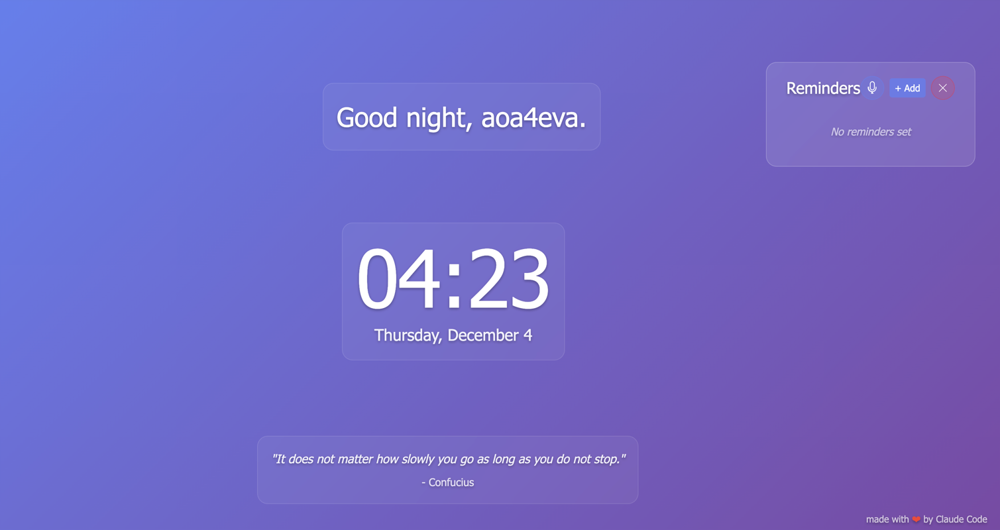

# A simple bootstrap template for project quick starts 

# What it is: 
A simple personal dashbaord that you can run from your local machine based on [nakai-ui](https://github.com/aoa4eva/nakai-ui)  

# How to use: 
1. Clone this repo
2. Edit the files in the `src` folder 
3. This is an html/css/js project, so you can edit it directly from your text editor or IDE. The template is simple enough to use with or without an LLM, so have fun and flex that creative muscle!

# Lessons for AI prompting:
1. Target complete features to develop at a time. 
2. You can definitely prompt in stages, but make sure you're clear about what you want to achieve, and that it can be developed independently of other features. 

#Template Features (by Claude)

### Display Components:
- Real-time clock showing current time (24-hour format) and date
- Dynamic greeting that changes based on time of day (morning/afternoon/evening/night)
- Random inspirational quote display from a set of 10 quotes

### User Customization:
- Settings modal accessible via navigation
- Name input field for personalized greetings
- Alarm setup for custom reminder sounds 
- Show/hide reminder widget
- User preferences stored in browser localStorage
- Setting for temperature units
- Setting for city for weather data 
- API token configuration for openweathermap.org
- Show/hide weather widget by providing/removing city data

### Navigation:
- Auto-hiding navigation bar that appears on hover
- Responsive mobile menu with hamburger toggle
- Three navigation items: Home, Settings, and About

### UI/UX:
- Bootstrap 5.3.2 integration for responsive layout
- Backdrop blur effects on navbar and modals
- Gradient background with support for custom background images
- Fade-in animations for content elements
- Responsive breakpoints for mobile (576px) and tablet (768px) devices

### Technical Features:
- LocalStorage persistence for user name
- Auto-updating time display (1-second interval)
- Auto-updating greeting (1-minute interval)
- Keyboard support (Enter key) in settings modal
- Click-outside-to-close functionality for mobile navbar
- Voice support for adding reminders
- Preview of default sound 
